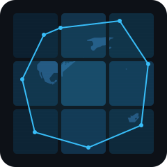

<div class="hero" markdown>

<div class="hero__logo" markdown>

</div>

<h1 class="hero__title">mapcv</h1>

<p class="hero__tagline">
Satellite imagery dataset creation for semantic segmentation.
</p>

<p class="hero__sub">
Rust core &middot; Python API &middot; XYZ tiles &middot; KML &amp; GeoJSON labels
</p>

<div class="hero__buttons" markdown>
[Get Started](getting-started.md){ .hero__btn .hero__btn--primary }
[GitHub](https://github.com/tahamukhtar20/mapcv){ .hero__btn .hero__btn--secondary }
</div>

<div class="hero__install" markdown>
`pip install mapcv`
</div>

</div>

---

## What is mapcv?

**mapcv** turns a bounding box and a set of polygon labels into a ready-to-train
image segmentation dataset.
It fetches XYZ map tiles, rasterizes KML or GeoJSON annotations onto the tile
grid, extracts fixed-size image/mask patches, and writes them to disk with a
JSON manifest.
The heavy lifting (tile stitching, rasterization, patch sampling) runs in Rust;
everything is exposed through a clean Python API and a single CLI command.

---

## How it works

<div class="pipeline" markdown>

<div class="pipeline__step" markdown>
<div class="pipeline__step-num">01</div>
<p class="pipeline__step-label">Fetch tiles</p>
<p class="pipeline__step-sub">async XYZ download</p>
</div>

<div class="pipeline__step" markdown>
<div class="pipeline__step-num">02</div>
<p class="pipeline__step-label">Stitch image</p>
<p class="pipeline__step-sub">Rust tile assembly</p>
</div>

<div class="pipeline__step" markdown>
<div class="pipeline__step-num">03</div>
<p class="pipeline__step-label">Parse labels</p>
<p class="pipeline__step-sub">KML / GeoJSON</p>
</div>

<div class="pipeline__step" markdown>
<div class="pipeline__step-num">04</div>
<p class="pipeline__step-label">Rasterize</p>
<p class="pipeline__step-sub">Rust polygon burn</p>
</div>

<div class="pipeline__step" markdown>
<div class="pipeline__step-num">05</div>
<p class="pipeline__step-label">Sample patches</p>
<p class="pipeline__step-sub">grid or random</p>
</div>

<div class="pipeline__step" markdown>
<div class="pipeline__step-num">06</div>
<p class="pipeline__step-label">Write dataset</p>
<p class="pipeline__step-sub">PNG + manifest</p>
</div>

</div>

---

## Features

<div class="features" markdown>

<div class="feature-card" markdown>
<div class="feature-card__icon">⚡</div>
<p class="feature-card__title">Rust-accelerated core</p>
<p class="feature-card__body">
Tile stitching, polygon rasterization, and patch sampling all run in
compiled Rust via PyO3 — orders of magnitude faster than pure-Python
equivalents.
</p>
</div>

<div class="feature-card" markdown>
<div class="feature-card__icon">🌍</div>
<p class="feature-card__title">Many tile sources</p>
<p class="feature-card__body">
Built-in support for Esri World Imagery, Google Satellite, OpenStreetMap,
CartoDB basemaps, and any custom XYZ URL template.
</p>
</div>

<div class="feature-card" markdown>
<div class="feature-card__icon">🗺️</div>
<p class="feature-card__title">KML &amp; GeoJSON labels</p>
<p class="feature-card__body">
Parse polygon annotations directly from KML or GeoJSON files.
Multiclass labels via a configurable field name.
Automatic WGS-84 to Web Mercator projection.
</p>
</div>

<div class="feature-card" markdown>
<div class="feature-card__icon">✂️</div>
<p class="feature-card__title">Flexible patch sampling</p>
<p class="feature-card__body">
Grid or random sampling with configurable stride, edge strategies
(pad / drop / shift), and empty-patch filtering.
</p>
</div>

<div class="feature-card" markdown>
<div class="feature-card__icon">📦</div>
<p class="feature-card__title">Train / val / test splits</p>
<p class="feature-card__body">
Stratified or random dataset splitting from the JSON manifest.
Configurable labeled-data fractions for semi-supervised workflows.
</p>
</div>

<div class="feature-card" markdown>
<div class="feature-card__icon">🔌</div>
<p class="feature-card__title">CLI + Python API</p>
<p class="feature-card__body">
Run the full pipeline with <code>mapcv generate config.yaml</code>,
or drive each stage individually from Python for maximum flexibility.
</p>
</div>

</div>

---

## Quickstart

=== "CLI"

    ```bash
    pip install mapcv

    # scaffold a config
    mapcv init my_dataset.yaml

    # edit the config, then run
    mapcv generate my_dataset.yaml
    ```

=== "Python"

    ```python
    from mapcv import (
        parse_geojson, stitch_region,
        transform_to_mercator, rasterize,
        sample_patches, SamplerConfig,
    )

    # 1. fetch and stitch tiles
    image, transform = stitch_region(
        west=4.883, south=52.371,
        east=4.896, north=52.378,
        zoom=17, source="esri_satellite",
    )

    # 2. load and rasterize labels
    geoms, _ = parse_geojson(open("labels.geojson", "rb").read())
    mask = rasterize(
        [(transform_to_mercator(g), cid) for g, cid in geoms],
        out_shape=image.shape[:2],
        transform=transform,
    )

    # 3. sample patches
    imgs, masks, meta = sample_patches(
        image, mask,
        SamplerConfig(patch_size=256, edge_strategy="drop"),
    )
    print(f"{len(meta)} patches")
    ```

---

## Installation

```bash
pip install mapcv
```

mapcv requires Python >= 3.10.
Pre-built wheels are available for Linux, macOS, and Windows on PyPI.

!!! note "Building from source"
    If no wheel is available for your platform, you need a Rust toolchain
    (`rustup`) and `maturin`:

    ```bash
    pip install maturin
    maturin develop --release
    ```

---

## License

MIT. Label data used in examples: (c) OpenStreetMap contributors, ODbL.
