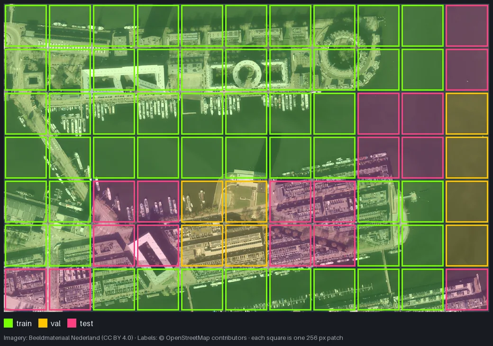

import { Aside } from '@astrojs/starlight/components';

mapcv writes `splits/train.txt`, `val.txt` and `test.txt` at the end of `generate` when the config has a `split` block, and `mapcv split` rewrites them from the manifest in seconds. This page helps you choose the settings. For the reasoning behind them, see [Spatial leakage](/mapcv/concepts/spatial-leakage/).

## Pick a strategy

| `strategy` | Unit that is assigned | Leakage between splits | Use it when |
| --- | --- | --- | --- |
| `spatial` (default) | Square blocks of the raster | None from overlapping pixels; much less from neighbouring ones | You want test scores that predict performance on new areas. Almost always |
| `stratified` | Individual patches, balanced by labeled fraction and dominant class (detection and instance: most frequent object class; classification: the patch's label) | Yes, if patches overlap or are adjacent | Reproducing an earlier patch-level split, e.g. from mapcv 0.1 |
| `random` | Individual patches, shuffled | Yes, if patches overlap or are adjacent | Quick experiments on non-overlapping, far-apart patches |
| `region` | Whole regions of an [area of interest](/mapcv/reference/configuration/#region) (`region.path` with `name_field`) | None between regions that are apart; adjacent regions lose their overlapping train/val patches | Several sites, cities or tiles: test on places the model never saw |

`test_ratio` is a fraction of all patches; `val_ratio` is a fraction of what is left. With the defaults (`0.20`, `0.10`), that is about 72 % train, 8 % val, 20 % test before any spatial adjustments.

## How the spatial split works



*A spatial split of the quickstart's dataset: green train, yellow val, pink test.*

1. The raster is divided into square blocks of `block_size` pixels. Each patch belongs to the block containing its top-left corner.
2. Blocks are shuffled with `seed` and assigned whole, one by one: a block goes to test if that brings test closer to its target size, otherwise to val if that brings val closer to its target, otherwise to train.
3. Train and val patches whose footprint overlaps any test patch are **left out**, and so are train patches that overlap a val patch. They are listed in no split file.

```console
$ mapcv split overlap
✓ Splits written to overlap/splits: train 137 (67%) · val 10 (5%) · test 57 (28%) · 69
overlapping patch(es) left out
```

That example used `stride: 128` with 256 px patches (heavy overlap) on a small raster. Without overlap (`stride` = `patch_size`, the default) nothing is left out.

### Choosing `block_size`

By default a block is 4 × `patch_size` pixels, reduced (never below one patch) so that the raster has at least 10 blocks. You can set it with `split.block_size` or `mapcv split --block-size`.

- **Larger blocks** separate splits more: neighbouring patches end up in the same split, and fewer patches sit on block borders. But whole blocks move together, so on a small raster the achieved ratios can drift from the targets (above: 28 % test instead of 20 %).
- **Smaller blocks** hit the ratios more precisely but put more test patches next to train patches.
- A useful lower bound is the distance over which your scene is similar: a few hundred metres for urban texture, kilometres for land cover. Convert with the pixel size from `mapcv plan`.

Check the achieved shares in the summary or with `mapcv info`, and adjust `block_size` or `seed` if one split is too small.

## Overlap warnings

If you choose `stratified` or `random` on a dataset whose patches overlap (`stride < patch_size`) or repeat (`mode: random`), mapcv still writes the split and warns:

```text
⚠  Patches overlap or repeat, so a 'random' split leaks pixels between train and test;
use strategy 'spatial'.
```

Even without overlap, adjacent patches share buildings, fields and lighting, so patch-level splits usually report optimistic scores. mapcv does not warn about that case.

Manifests from mapcv 0.1 do not record the patch size. A `spatial` split of such a dataset falls back to `stratified` with a warning unless you pass `--block-size`.

## Re-split without regenerating

```bash
mapcv split dataset                                   # defaults: spatial, 0.2 / 0.1
mapcv split dataset --block-size 2048 --seed 7
mapcv split dataset --strategy stratified --test-ratio 0.15
```

The command reads only `manifest.json`, overwrites `train/val/test.txt` and `split.json`, and (re)writes the labeled subsets. It does not read the `split` block of your YAML; `split.json` records which settings produced the current lists.

## Semi-supervised subsets

For each value in `labeled_ratios` (default `[0.10, 0.20, 0.30]`), mapcv shuffles `train.txt` and writes:

- `splits/<percent>/labeled.txt`: the first ⌈ratio × len(train)⌉ patches,
- `splits/<percent>/unlabeled.txt`: the rest.

`<percent>` is the ratio as a percentage, written exactly (`0.05` → `5/`, `0.125` → `12.5/`). Val and test are shared across all subsets, so results at different label budgets are comparable.

```bash
mapcv split dataset --labeled-ratios 0.01 --labeled-ratios 0.05 --labeled-ratios 0.1
```

In YAML, set `labeled_ratios: []` to skip them.

<Aside>
Subsets are drawn from the shuffled train list, not spatially. If your semi-supervised method assumes the labeled and unlabeled images come from different areas, build those lists yourself from the manifest's `row` and `col`.
</Aside>

## Sub-sampling

`sample_limit` splits only a sample of the patches, for example to build a small benchmark from a large dataset. For `spatial` and `stratified`, the sample keeps the mix of empty, fully labeled and mixed patches; patches outside the sample appear in no list.
