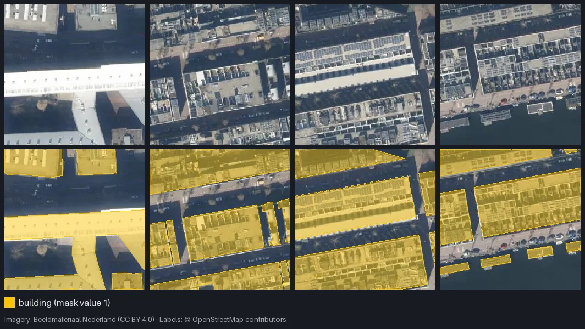

import { Card, CardGrid, FileTree, LinkCard } from '@astrojs/starlight/components';
import TerminalSteps from '../../components/TerminalSteps.astro';

Three commands

## From config to dataset in minutes

<TerminalSteps />

Real (trimmed) output from the [Quickstart](/mapcv/quickstart/): 967 OpenStreetMap building outlines in Amsterdam, imagery at about 0.36 m per pixel, 77 labeled patches in under half a minute. Figure: patches and masks over the same area (imagery: Beeldmateriaal Nederland, CC BY 4.0; labels: © OpenStreetMap contributors).

Why mapcv

## Built for the dataset step, and only that

<CardGrid>
  <Card title="No GDAL, Rust core" icon="seti:rust">
    Tile fetching, GeoTIFF reading, rasterizing and patch encoding run in Rust. One wheel per
    platform covers Python 3.10 and newer. `pip install` and go.
  </Card>
  <Card title="Leakage-safe splits" icon="approve-check">
    The default `spatial` split keeps whole blocks of the map in one split and drops train/val
    patches that overlap a test patch, so scores aren't inflated by shared pixels.
  </Card>
  <Card title="Any imagery, six tasks" icon="seti:image">
    XYZ tiles, your own GeoTIFF/COG, Sentinel-2 (EOPF or STAC with cloud masking) or Earth
    Engine, into segmentation, detection, instance, classification, change or regression data.
  </Card>
  <Card title="Large regions, resumable" icon="puzzle">
    `mapcv plan` estimates tiles, disk and memory first. Generation runs in bounded windows and
    picks up where it stopped, byte for byte the same as an uninterrupted run.
  </Card>
  <Card title="ML-ready output" icon="seti:pipeline">
    Patches as PNG, JPEG, NPY or georeferenced GeoTIFF, COCO/YOLO, a manifest and split lists.
    Load them with `MapcvDataset`, or export to Hugging Face, WebDataset, Zarr and TerraTorch.
  </Card>
  <Card title="Keys stay private" icon="information">
    API keys in a tile URL never reach the manifest, logs or messages, and Earth Engine runs on
    your own login. Each source's credit line is listed and written into the dataset card.
  </Card>
</CardGrid>

What you get

## A folder you can train on

<FileTree>
- dataset/
  - Images/
    - patch_0000000.png RGB patch (or bands-first float32 .npy)
    - …
  - Masks/
    - patch_0000000.png same name, uint8 class IDs
    - …
  - manifest.json source, CRS, transform, class map, per-patch stats
  - splits/
    - train.txt
    - val.txt
    - test.txt
    - split.json how the split was made
    - 10/ labeled.txt and unlabeled.txt for semi-supervised work
      - labeled.txt
      - unlabeled.txt
</FileTree>

See [Dataset format](/mapcv/reference/dataset-format/) for every field.

How it compares

## Where mapcv fits

mapcv does one job: it writes a static, reproducible dataset from imagery and labels, checked against reference implementations. On the [benchmarks](/mapcv/project/performance/), a careful rasterio script, GDAL's tools and leafmap produce the same patches, 1.5–34× more slowly.

- **[TorchGeo](https://github.com/torchgeo/torchgeo)** samples patches on the fly from rasters inside PyTorch and ships many benchmark datasets. Pick it to train directly on large rasters.
- **[Raster Vision](https://github.com/azavea/raster-vision)** covers the full workflow from data to trained model and prediction. Pick it if you want one framework end to end.
- **Your own GDAL/rasterio script** handles any one-off. mapcv handles the parts scripts get wrong at scale: exact grids, NoData, memory, resuming and leakage-safe splits.

More in [Why mapcv](/mapcv/why-mapcv/).

The tools combine well: a mapcv dataset is plain files, so you can train it with any library.

Next

## Pick your path

<CardGrid>
  <LinkCard title="Quickstart" description="Build a labeled dataset of buildings in five minutes." href="/mapcv/quickstart/" />
  <LinkCard title="Tutorials" description="Buildings from aerial imagery, land cover from Sentinel-2, then train a model." href="/mapcv/tutorials/buildings-from-aerial-imagery/" />
  <LinkCard title="Use your dataset" description="Load patches, masks and splits in NumPy or PyTorch." href="/mapcv/guides/use-your-dataset/" />
  <LinkCard title="Configuration reference" description="Every YAML field, its default and how it is validated." href="/mapcv/reference/configuration/" />
</CardGrid>
