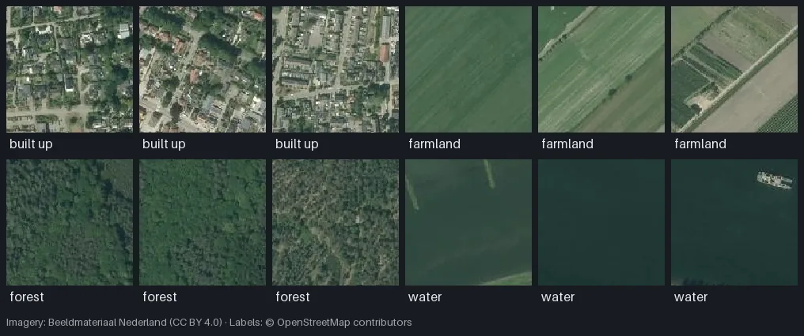

import { Aside, Steps, LinkCard, FileTree } from '@astrojs/starlight/components';

This tutorial builds a **scene classification** dataset in the style of EuroSAT and BigEarthNet: Esri World Imagery near Amerongen in the Netherlands at about 1.5 m per pixel, cut into 128 × 128 patches (about 190 m wide), each labeled with the land use that covers most of it: built-up, farmland, forest or water. mapcv decides the label from the share of every patch that each OpenStreetMap polygon class covers, and writes the labels as a CSV and a JSON file next to the images.

**Time:** about 10 minutes. **You need:** `pip install mapcv`; `torch` + `torchvision` for the training step.

<Steps>

1. ### Get the labels

   The labels are the 643 land-use, forest and water polygons of the [Sentinel-2 example](/mapcv/tutorials/land-cover-from-sentinel-2/), grouped into a `class` property with four values:

   ```bash
   mkdir landuse-scenes && cd landuse-scenes
   curl -LO https://raw.githubusercontent.com/tahamukhtar20/mapcv/main/examples/sentinel2-landcover/landuse.geojson
   ```

   OSM data is © OpenStreetMap contributors under the ODbL, which asks you to credit it when you share the result.

2. ### Write the config

   It is a segmentation config plus `task: classification` and an optional `classification` block. `mapcv init --template classification` writes a commented starting point.

   ```yaml title="mapcv.yaml" {1,19-22}
   task: classification

   region:
     west: 5.400
     south: 51.975
     east: 5.500
     north: 52.035

   imagery:
     type: xyz
     zoom: 16                   # ≈ 1.5 m/px at this latitude
     source: esri_satellite
     max_connections: 4

   labels:
     path: landuse.geojson
     label_field: class         # built_up, farmland, forest, water

   classification:
     mode: single               # one label per patch
     min_fraction: 0.5          # the class must cover at least half of the patch
     empty: skip                # drop patches no class covers that much

   sampler:
     patch_size: 128            # ≈ 190 m per patch
     edge_strategy: drop

   writer:
     staging_dir: ./dataset
     image_format: png

   split:
     strategy: spatial          # whole blocks per split: no leakage between splits
     test_ratio: 0.20
     val_ratio: 0.10
     seed: 42
   ```

   How a patch gets its label:

   - **Coverage.** mapcv burns the labels into the same class mask that `task: segmentation` would write, with the same rasterizer and pixel rule, and counts the pixels of each class. A class's *coverage* is its pixels divided by the patch's **valid** pixels: pixels that have imagery (not NoData, not a failed tile, not padding) and are not `labels.ignore_index`. Where polygons overlap, the later one in the file wins, as in a segmentation mask.
   - **`single`** gives the patch the class with the largest coverage (a tie goes to the lowest class ID), as long as that class reaches `min_fraction`. **`multi`** gives it every class that reaches `min_fraction`.
   - **`min_fraction`** is inclusive, and `0` means "any labeled pixel": a class qualifies when its coverage is at least this and above zero.
   - **`empty`** says what happens to a patch no class qualifies for: `skip` drops it, `background` keeps it with the label `background`.

   All options: [Configuration → classification](/mapcv/reference/configuration/#classification).

3. ### Plan

   ```console
   $ mapcv plan mapcv.yaml
   ╭─ Plan for mapcv.yaml ────────────────────────────────────────────────────────╮
   │ Task     classification · single-label · min_fraction 0.5 · empty: skip      │
   │ Region   5.4, 51.975 → 5.5, 52.035  (≈ 6.9 × 6.6 km)                         │
   │ Imagery  esri_satellite · zoom 16 (≈ 1.47 m/px)                              │
   │ Raster   4,864 × 4,608 px · 342 tiles (≈ 8.6 MB to download)                 │
   │ Labels   landuse.geojson · 643 polygon(s) · classes: built_up → 1,           │
   │          farmland → 2, forest → 3, water → 4                                 │
   │ Patches  ≈ 1,368 × 128 px (grid, stride 128)                                 │
   │ Output   dataset · png (≈ 37.3 MB)                                           │
   │ Split    spatial · test 0.2 · val 0.1                                        │
   │ Memory   ≈ 44.8 MB per chunk                                                 │
   ╰──────────────────────────────────────────────────────────────────────────────╯
   ```

   The plan counts every grid position. Patches that no class covers by at least half are dropped when the dataset is built, so it will hold fewer.

4. ### Generate

   ```console
   $ mapcv generate mapcv.yaml
   ╭─ Dataset ready ──────────────────────────────────────────────────────────────╮
   │ Patches  984                                                                 │
   │ Source   xyz · esri_satellite                                                │
   │ Shape    128×128×3 uint8                                                     │
   │ Tiles    342 fetched · 0 failed                                              │
   │ Splits   train 700 (71%) · val 81 (8%) · test 203 (21%)                      │
   │ Time     51s                                                                 │
   │ Files    dataset/ (images/, manifest.json, splits/, labels.csv, labels.json, │
   │          classes.txt)                                                        │
   ╰──────────────────────────────────────────────────────────────────────────────╯
     label       id    patches    share
     built_up     1        106    10.8%
     farmland     2        228    23.2%
     forest       3        590    60.0%
     water        4         60     6.1%
   ```

   984 of the 1,368 grid positions had a class over half of them; the rest are mixed or unlabeled and were skipped. `mapcv info dataset` shows the same table later.

   <FileTree>
   - dataset/
     - images/ 984 × patch_0000000.png …
     - labels.csv image,labels,split for every patch
     - labels_train.csv image,labels of the 700 train patches
     - labels_val.csv 81 val patches
     - labels_test.csv 203 test patches
     - classes.txt built_up, farmland, forest, water: one per line
     - labels.json the classes and every image's labels
     - manifest.json
     - splits/ the split as patch names, as for every task
     - patches.geojson footprints of the patches, to open in QGIS
   </FileTree>

   `labels.csv` is one row per patch:

   ```text title="dataset/labels.csv"
   image,labels,split
   patch_0000000.png,forest,train
   patch_0000001.png,forest,train
   patch_0000002.png,forest,train
   ```

   `labels.json` holds the same labels as arrays, so a multi-label dataset needs no parsing:

   ```json title="dataset/labels.json"
   {
     "classes": ["built_up", "farmland", "forest", "water"],
     "images": {
       "patch_0000000.png": ["forest"],
       "patch_0000001.png": ["forest"],
       …
   ```

   `manifest.json` records every patch's coverage per class and its labels, so you can pick a stricter threshold later without touching the imagery:

   ```json
   {"row":0,"col":0,"padded":false,"chunk":0,"files":{"image":"images/patch_0000000.png"},"summary":{"class_coverage":{"3":0.912109375},"labels":[3],"empty_ratio":0.0}}
   ```

5. ### Look at the patches

   

   *Three patches per class, each covered by its class for at least half its area. Shown with Dutch open aerial imagery (Beeldmateriaal Nederland, CC BY 4.0) over the same area; with the tutorial's Esri imagery your patches look alike.*

   ```python title="look.py"
   import csv
   import random

   import matplotlib.pyplot as plt
   from PIL import Image

   with open("dataset/labels_train.csv", newline="", encoding="utf-8") as handle:
       rows = list(csv.DictReader(handle))

   random.seed(0)
   by_label = {}
   for row in rows:
       by_label.setdefault(row["labels"], []).append(row["image"])

   fig, axes = plt.subplots(len(by_label), 4, figsize=(8, 2 * len(by_label)))
   for line, (label, images) in zip(axes, sorted(by_label.items())):
       for ax, image in zip(line, random.sample(images, 4)):
           ax.imshow(Image.open(f"dataset/images/{image}"))
           ax.axis("off")
       line[0].set_title(f"{label} ({len(images)})", loc="left", fontsize=9)
   plt.tight_layout()
   plt.show()
   ```

   The rows are the four classes (59, 132, 462 and 47 train patches). A label is only as good as the polygons: OSM's forest polygons contain clearings and a few houses, and a farmland patch can hold a corner of a pond. That is why `min_fraction: 0.5` is a sensible start; raise it for cleaner, rarer examples.

6. ### Train a classifier

   `labels_train.csv` and `labels_val.csv` are everything a loader needs. This dataset class reads a split and returns an image with its class index (the position of the name in `classes.txt`):

   ```python title="train_classifier.py"
   import csv

   import torch
   import torchvision
   from PIL import Image
   from torchvision.transforms.functional import to_tensor

   ROOT = "dataset"
   classes = open(f"{ROOT}/classes.txt", encoding="utf-8").read().splitlines()
   index = {name: i for i, name in enumerate(classes)}


   class Scenes(torch.utils.data.Dataset):
       def __init__(self, split):
           with open(f"{ROOT}/labels_{split}.csv", newline="", encoding="utf-8") as handle:
               self.rows = list(csv.DictReader(handle))

       def __len__(self):
           return len(self.rows)

       def __getitem__(self, i):
           row = self.rows[i]
           image = Image.open(f"{ROOT}/images/{row['image']}").convert("RGB")
           return to_tensor(image), index[row["labels"]]


   train = torch.utils.data.DataLoader(Scenes("train"), batch_size=32, shuffle=True)
   val = torch.utils.data.DataLoader(Scenes("val"), batch_size=64)

   model = torchvision.models.resnet18(weights="DEFAULT")
   model.fc = torch.nn.Linear(model.fc.in_features, len(classes))
   optimizer = torch.optim.AdamW(model.parameters(), lr=1e-3)
   loss_fn = torch.nn.CrossEntropyLoss()

   for epoch in range(10):
       model.train()
       for images, labels in train:
           loss = loss_fn(model(images), labels)
           optimizer.zero_grad()
           loss.backward()
           optimizer.step()
       model.eval()
       correct = 0
       with torch.no_grad():
           for images, labels in val:
               correct += (model(images).argmax(1) == labels).sum().item()
       print(epoch, loss.item(), correct / len(val.dataset))
   ```

   The classes are unbalanced (60 % forest), so look at per-class recall, not only accuracy, and consider a weighted loss. Evaluate once on `labels_test.csv` at the end.

7. ### Variations

   - **Several labels per patch.** Set `mode: multi`, `min_fraction: 0.1` and `empty: background`: a patch gets every class that covers at least 10 % of it, and a patch with no such class is kept as `background`. On the same area that makes 1,368 patches, among them 149 `background`, 598 `forest` only, 105 `farmland forest` and a few with three classes. `labels.csv` then holds the names joined by a space, and `classes.txt` starts with `background`:

     ```text title="dataset/labels.csv"
     image,labels,split
     patch_0000000.png,forest,train
     patch_0000007.png,farmland forest,test
     patch_0000010.png,background,train
     patch_0000423.png,built_up farmland,train
     ```

     Turn `labels.json` into multi-hot targets with `classes` for the column order, and train with `BCEWithLogitsLoss`:

     ```python
     import json

     import torch

     data = json.load(open("dataset/labels.json"))
     index = {name: i for i, name in enumerate(data["classes"])}


     def multi_hot(names):
         target = torch.zeros(len(index))
         for name in names:
             target[index[name]] = 1.0
         return target
     ```

     In `multi` mode class names cannot contain whitespace (it separates the labels in the CSV); mapcv stops with a message that names the class if one does.
   - **Any pixel counts.** With the default `min_fraction: 0`, a patch gets a label as soon as one valid pixel is labeled. Useful for rare classes such as a road or a pond that cover little of a patch; combine it with `multi`.
   - **Label rasters.** `labels.type: raster` works too: the label raster is sampled onto each patch exactly as for [segmentation](/mapcv/reference/configuration/#raster-labels-type-raster), and the classes you declare in `labels.classes` become the labels (use `name:` to choose them). Pixels outside the label raster, on its NoData or on `ignore_values` are not valid and do not count.
   - **Re-split without regenerating.** `mapcv split dataset --strategy spatial --test-ratio 0.3` rewrites the `split` column of `labels.csv` and the three `labels_<split>.csv` files from the manifest. With `--strategy stratified` the strata come from each patch's label (for several labels, the one with the largest coverage), so every class is spread over the splits in proportion.

</Steps>

<Aside type="caution">
A dataset's classification settings are part of it: resuming with a different `mode`, `min_fraction` or `empty` (or `labels.all_touched`) is refused. Write to a new `staging_dir` instead. Patches without a single valid pixel (all NoData or failed tiles) are never labeled; use `sampler.max_empty_ratio` to also drop patches that are mostly without imagery, since a label over a few valid pixels is a poor one.
</Aside>

## Attribution

If you publish this dataset or a model trained on it, credit the sources: imagery by Esri World Imagery (check Esri's current terms for your use case first) and labels © OpenStreetMap contributors (ODbL). See [Providers & licensing](/mapcv/project/providers/).

## Next

<LinkCard title="Dataset format → classification datasets" description="Every column of the CSV, JSON and manifest files." href="/mapcv/reference/dataset-format/#classification-datasets" />
