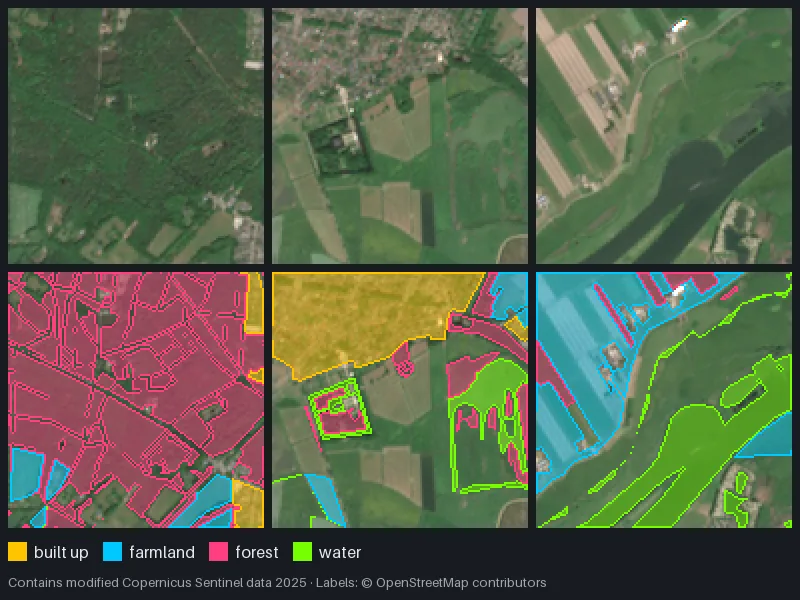

import { Aside, Steps, LinkCard } from '@astrojs/starlight/components';

This tutorial builds a multispectral land-cover dataset near Amerongen in the Netherlands: red, green, blue and near-infrared Sentinel-2 bands at **10 m**, labeled with four classes (built-up, farmland, forest, water) from OpenStreetMap, cut into 128 × 128 patches stored as `float32` NumPy arrays.

**Time:** about 15 minutes, most of it waiting for the product to stream. **You need:** Python **3.10–3.13** and an internet connection.

The finished files are in [`examples/sentinel2-landcover`](https://github.com/tahamukhtar20/mapcv/tree/main/examples/sentinel2-landcover); this page is self-contained.

<Steps>

1. ### Install the Sentinel-2 extra

   ```bash
   pip install "mapcv[zarr]"
   ```

   This adds xarray-eopf, xarray, Dask, zarr 2, pyproj and s3fs. On Python 3.14 the extra installs nothing (see [Installation](/mapcv/installation/#optional-extras)).

2. ### Pick a product

   mapcv reads one Sentinel-2 L2A product in ESA's EOPF Zarr format per run. Find one in the [EOPF STAC browser](https://stac.browser.user.eopf.eodc.eu/) (collection *sentinel-2-l2a*): filter by your area and date, sort by cloud cover, and copy the product's `.zarr` link. This tutorial uses an almost cloud-free scene from 13 May 2025 (tile 31UFT, 0.03 % cloud):

   ```text
   https://objectstore.eodc.eu:2222/e05ab01a9d56408d82ac32d69a5aae2a:202505-s02msil2a/13/products/cpm_v256/S2A_MSIL2A_20250513T104041_N0511_R008_T31UFT_20250513T143716.zarr
   ```

   No account or key is needed. Copernicus Sentinel data is free and open; credit it as "Contains modified Copernicus Sentinel data [2025]".

3. ### Get the labels

   ```bash
   mkdir s2-landcover && cd s2-landcover
   curl -LO https://raw.githubusercontent.com/tahamukhtar20/mapcv/main/examples/sentinel2-landcover/landuse.geojson
   ```

   The file holds 643 OpenStreetMap land-use, forest and water polygons (© OpenStreetMap contributors, ODbL), already grouped into a `class` property with four values. To make your own, see [Prepare labels](/mapcv/guides/prepare-labels/#use-openstreetmap-data-as-labels).

4. ### Write the config

   Start from `mapcv init mapcv.yaml --template sentinel2`, or save this directly:

   ```yaml title="mapcv.yaml"
   region:                      # WGS-84 lon/lat, inside the product's footprint
     west: 5.400
     south: 51.975
     east: 5.500
     north: 52.035

   imagery:
     type: eopf_zarr
     path: https://objectstore.eodc.eu:2222/e05ab01a9d56408d82ac32d69a5aae2a:202505-s02msil2a/13/products/cpm_v256/S2A_MSIL2A_20250513T104041_N0511_R008_T31UFT_20250513T143716.zarr
     resolution: 10             # metres; the 10 m bands are b02, b03, b04 and b08
     bands: [b04, b03, b02, b08]   # red, green, blue, near-infrared, in this order

   labels:
     path: landuse.geojson
     label_field: class
     classes:                   # pin the mask values instead of relying on sorted order
       built_up: 1
       farmland: 2
       forest: 3
       water: 4

   sampler:
     patch_size: 128            # 1.28 km per patch at 10 m
     edge_strategy: drop
     max_empty_ratio: 0.2       # skip patches with more than 20 % NoData (NaN)

   writer:
     staging_dir: ./dataset
     image_format: npy          # float32, bands-first: (4, 128, 128)

   split:
     strategy: spatial
     test_ratio: 0.20
     val_ratio: 0.10
     seed: 42
   ```

   What differs from an XYZ config:

   - **`imagery.bands`** sets both which bands are read and their order in every array. Omit it for all 12 L2A bands.
   - **`resolution`** is the output grid; bands with a coarser native resolution are resampled onto it.
   - **`image_format: npy`** is required: reflectance is `float32` with `NaN` for no data, which PNG can't store.
   - **`edge_strategy: drop`** and **`max_empty_ratio: 0.2`** avoid zero-padded and mostly-`NaN` patches at the edges.

5. ### Plan

   ```console
   $ mapcv plan mapcv.yaml
   ╭─ Plan for mapcv.yaml ────────────────────────────────────────────────────────────────╮
   │ Region   5.4, 51.975 → 5.5, 52.035  (≈ 6.9 × 6.6 km)                                 │
   │ Imagery  Sentinel-2 L2A (EOPF) · 4 bands (≈ 10.00 m/px)                              │
   │ Raster   709 × 692 px                                                                │
   │ Labels   landuse.geojson · 643 polygon(s) · classes: built_up → 1, farmland → 2,     │
   │          forest → 3, water → 4                                                       │
   │ Patches  ≈ 25 × 128 px (grid, stride 128)                                            │
   │ Output   dataset · npy (≈ 6.6 MB)                                                    │
   │ Split    spatial · test 0.2 · val 0.1                                                │
   │ Memory   ≈ 16.7 MB per chunk                                                         │
   ╰──────────────────────────────────────────────────────────────────────────────────────╯
   ```

   For Sentinel-2 the raster size is computed on the region's UTM grid; the product's exact grid is known once it is opened.

6. ### Generate

   ```console
   $ mapcv generate mapcv.yaml
     Reading imagery and writing patches ━━━━━━━━━━━━━━━ 1/1 chunks • 0:01:11 • eta 0:00:00
   ╭─ Dataset ready ──────────────────────────────────────────────────────────────────────╮
   │ Patches  25                                                                          │
   │ Shape    4×128×128 float32                                                           │
   │ Splits   train 18 (72%) · val 2 (8%) · test 5 (20%)                                  │
   │ Time     1m 47s                                                                      │
   │ Files    dataset/ (Images/, Masks/, manifest.json, splits/)                          │
   ╰──────────────────────────────────────────────────────────────────────────────────────╯
     class         id    pixels
     background     0     25.7%
     built_up       1      7.8%
     farmland       2     19.0%
     forest         3     42.9%
     water          4      4.7%
   ```

   <Aside type="note" title="Be patient after the plan">
   mapcv first opens the remote product to find its CRS and pixel grid, then crops it to your region; an "Opening imagery…" spinner shows meanwhile. That can take a minute or more. A local copy of the product is much faster.

   Remote reads can time out (`Generation failed: 408, message='Request Time-out', …`). Run the same command again: finished chunks are kept, and a chunk with a failed band read is never written.
   </Aside>

   About a quarter of the pixels are background: land that none of the four classes covers.

7. ### Inspect

   ```console
   $ mapcv info dataset
   ╭─ dataset ────────────────────────────────────────────────────────────────────────────╮
   │ Task      segmentation                                                               │
   │ Source    eopf_zarr ·                                                                │
   │           S2A_MSIL2A_20250513T104041_N0511_R008_T31UFT_20250513T143716.zarr          │
   │ Bands     b04, b03, b02, b08                                                         │
   │ Patches   25 · 4×128×128 float32                                                     │
   │ CRS       EPSG:32631                                                                 │
   │ Ignore    mask value 255 marks pixels without imagery                                │
   │ Splits    train 18 (72%) · val 2 (8%) · test 5 (20%)                                 │
   │ Manifest  version 3                                                                  │
   ╰──────────────────────────────────────────────────────────────────────────────────────╯
   ```

   The patches are in the product's own UTM zone (EPSG:32631), not Web Mercator: mapcv reprojected the labels into it rather than resampling the imagery. See [Coordinates and grids](/mapcv/concepts/coordinates-and-grids/).

8. ### Look at the bands

   

   *Patches from this tutorial's product as true colour (b04, b03, b02, stretched) and with their masks. Contains modified Copernicus Sentinel data 2025; labels © OpenStreetMap contributors.*

   ```python
   import json
   import numpy as np
   from PIL import Image

   manifest = json.load(open("dataset/manifest.json"))
   bands = manifest["sources"][0]["bands"]            # ['b04', 'b03', 'b02', 'b08']
   class_map = manifest["target"]["class_map"]
   names = {cid: name for name, cid in class_map.items()} | {0: "background", 255: "no data"}

   files = manifest["patches"][0]["files"]            # paths relative to dataset/
   image = np.load(f"dataset/{files['image']}")       # (4, 128, 128) float32 reflectance
   mask = np.asarray(Image.open(f"dataset/{files['mask']}"))

   red, nir = image[bands.index("b04")], image[bands.index("b08")]
   ndvi = (nir - red) / (nir + red + 1e-6)
   for cid in np.unique(mask):
       print(f"{names[int(cid)]:<10} mean NDVI {np.nanmean(ndvi[mask == cid]):.2f}")

   rgb = np.clip(np.moveaxis(image[[0, 1, 2]], 0, -1) * 3.5, 0, 1)   # simple true-colour stretch
   ```

   Forest should show the highest NDVI and built-up areas the lowest. Treat `NaN` as no data in anything you compute.

</Steps>

## Things to try

- **More bands:** remove `bands` to get all 12 at 10 m, or set `resolution: 20` for the red-edge and SWIR bands at their native grid. Use a new `staging_dir`: band changes can't be resumed into the old folder.
- **Bigger patches or overlap:** `patch_size: 256`, or `stride: 64` with the default `spatial` split, which leaves out train/val patches overlapping test.
- **Another date:** swap `imagery.path` for a product from a different season and compare class separability.

## Attribution

Credit "Contains modified Copernicus Sentinel data [2025]" for the imagery and "© OpenStreetMap contributors" (ODbL) for the labels. See [Providers & licensing](/mapcv/project/providers/).

## Next

<LinkCard title="Train a model on your dataset" description="Feed these patches into a PyTorch training loop." href="/mapcv/tutorials/train-a-model/" />
